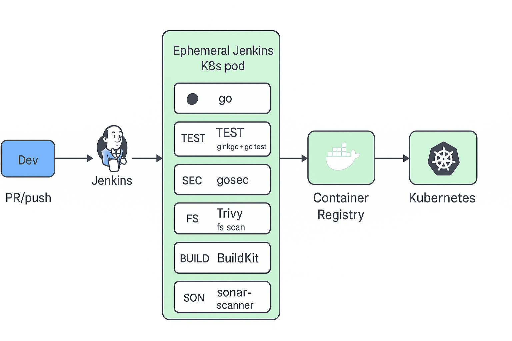
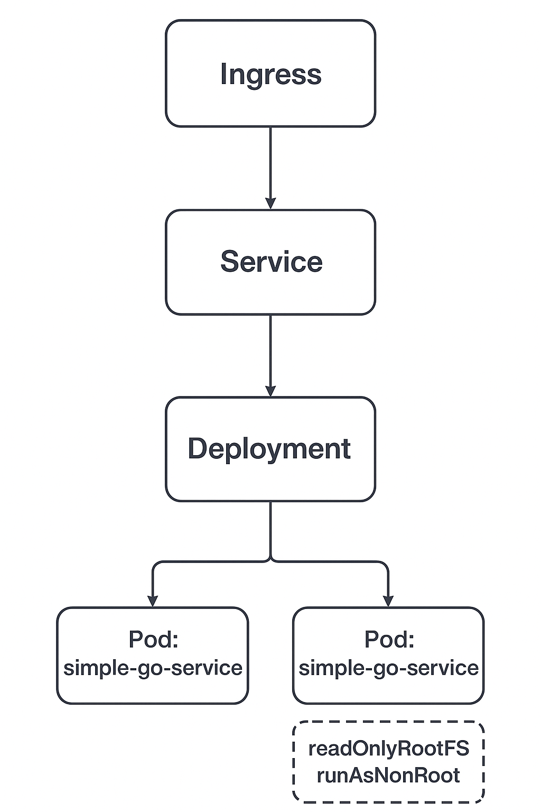
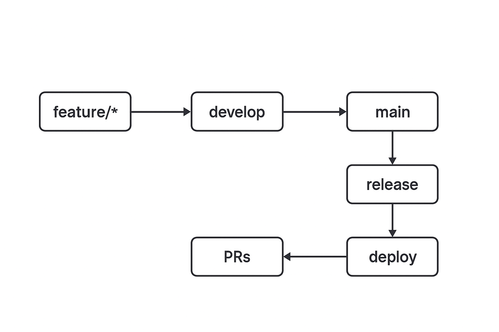

# Simple Go Service — CI/CD, Security, and Zero-Downtime Delivery

This project demonstrates a complete CI/CD pipeline for a Go microservice using **Jenkins**, **Jenkins Configuration as Code (JCasC)**, and **Kubernetes cloud agents**.  
It includes secure build practices (**BuildKit + distroless runtime**), static analysis, vulnerability scanning, **Helm-based** zero-downtime deployment, and monitoring hooks.

---

## 1. Implementation Details

- **Repository Setup**
  - Forked a Go microservice repo.
  - Organized branches:
    - `feature/ci-bootstrap` → Jenkins setup & pipeline.
    - `deps/update-deps` → Upgraded Go modules and base images.
    - `docs/readme` → Documentation.
    - `develop` → Integration branch.
    - `main` → Protected production branch.
```bash
.
├── cmd
│   └── simple-go-service
│       ├── internal
│       │   ├── internal_suite_test.go
│       │   ├── presenter.go
│       │   └── presenter_test.go
│       └── main.go
├── Dockerfile
├── go.mod
├── go.sum
├── helm
│   ├── buildkit
│   │   └── buildkitd.yaml
│   ├── jenkins
│   │   ├── jenkins-casc-config.yaml
│   │   ├── jenkins-pvc.yaml
│   │   ├── jenkins-pv.yaml
│   │   └── jenkins-values.yaml
│   └── simple-go-service
│       ├── templates
│       │   ├── deployment.yaml
│       │   └── service.yaml
│       └── values.yaml
├── Jenkinsfile
├── jenkins-image
│   ├── casc_configs
│   │   └── jenkins.yaml
│   ├── Dockerfile
│   └── plugins.txt
├── Makefile
├── monitoring-ci
│   └── Jenkinsfile-monitoring
├── README.md
└── sonar-project.properties

12 directories, 23 files
```

- **Jenkins Setup**
  - Jenkins deployed on Kubernetes (`cicd` namespace).
  - **JCasC** used for plugins, credentials, and agent templates (version-controlled).
  - Kubernetes cloud agents provisioned per-stage (Go, Trivy, Sonar, Helm).

- **Pipeline Implementation**
  - Stages:
    1. **Checkout** → pull code from repo.
    2. **Deps** → Go deps tidy, ensure reproducible builds.
    3. **Test & Coverage** → Ginkgo + go test; reports archived. 
    4. **Static Analysis** → gosec (non-blocking).
    5. **Filesystem Scan** → Trivy scan of source.
    6. **Build & Push** → BuildKit builds image & pushes to DockerHub (`docker.io/angel3/simple-go-service`).
    7. **Image Scan** → Trivy scans the pushed image.
    8. **SonarCloud** → code quality + coverage reports.
    9. **Deploy (Helm)** → zero-downtime rolling update (`helm upgrade --install … --wait`).

- **CI/CD Flow**
  - Full pipeline runs on **any branch**.
  - Deploy stage runs only for **`master`** branch merges.
  

- **Security and Scanning**
  - **Trivy** → **HIGH/CRITICAL** vulnerability scans (filesystem & image).
  - **gosec** → static analysis of Go code.
  - **SonarCloud** → coverage, maintainability, code smells. 

- **Branch Protection**
  - `master` is protected:
    - No direct pushes.
    - Requires PR reviews.
    - Requires Jenkins status checks to pass.

- **Monitoring & Observability**
  - Healthcheck at `/v1/data` is **intentionally failing** to exercise Prometheus/Grafana alerts.

---

## 2. Why Jenkins Configuration as Code (JCasC)?

- **Reproducibility** → Jenkins setup (clouds, credentials, plugins) is declarative, not manual.  
- **Portability** → bootstrap Jenkins in any cluster quickly.  
- **Security** → secrets referenced, not embedded.  
- **Auditability** → config reviewed via Git.  
- **Scalability** → ephemeral Kubernetes agents per pipeline.

---

## 3. System Design Diagrams

### 3.1 CI/CD Flow


### 3.2 Runtime Architecture


### 3.3 Deployment Flow


---

## 4. Known Design Choices

- **BuildKit over Kaniko** → fewer entrypoint/secret issues; faster daemonless builds.  
- **Multi-stage build**:
  - **Builder** → `golang:1.25-alpine3.22` (with `CGO_ENABLED=0`).
  - **Runtime** → `gcr.io/distroless/static:nonroot`.  
  - Hardening: `runAsNonRoot`, `readOnlyRootFilesystem`.  
- **Deliberately failing `/v1/data`** → monitoring/alerting drill endpoint.

---

## 5. Breaking Changes from Dependency Updates

- **Go 1.25** upgrade (from older version).  
- **Distroless runtime** → no shell inside container. Debug via `kubectl debug` toolbox pod.  
- Build flags: `-ldflags "-s -w" -extldflags "-static"` ensure static linking.  

---

## 6. SonarCloud Configuration

A `sonar-project.properties` file is included for reproducibility:

```properties
sonar.projectKey=<your_project_key>     <-- You can find this in SonarCloud-->Organizations-->Organization Settings-->General
sonar.organization=<your_organization>  <-- (same place as above)
sonar.host.url=https://sonarcloud.io    <-- SonarCloud URL (default)
sonar.sources=.                         <-- Source code directory
sonar.exclusions=**/*_test.go           <-- Exclude test files from analysis
sonar.tests=.                           <-- Test files directory
sonar.test.inclusions=**/*_test.go      <-- Include only test files
sonar.go.coverage.reportPaths=coverage.out  <-- Path to coverage report
sonar.language=go                   <-- Language of the project
```

---

## 7. Bonus: Suggested Improvements

* Repo Hygiene

    - Enforce PR reviews (CODEOWNERS).

    - Require signed commits.

    - Use Dependabot/Renovate for dependency PRs.

* Supply Chain Security

    - Generate SBOM (Syft).

    - Scan with Grype.

    - Sign images with Cosign.

    - Enforce via Kyverno/OPA.

* Secrets Management

    - Use SealedSecrets or External Secrets Operator.

* Progressive Delivery

    - Replace rolling updates with canary or blue-green (Argo Rollouts).

* Observability

    - /metrics endpoint for Prometheus.

    - Grafana dashboards for latency/RPS/errors.

    - Alerts on /v1/data failures.

* Networking

    - Service Mesh (Istio) with strict mTLS and AuthorizationPolicies.

    - Default-deny NetworkPolicies.

---

## 8. How to Run
```bash
# Push feature branch
git checkout -b feature/some-change
git push origin feature/some-change

# PR to develop → pipeline runs (build, scan, test).
# Merge develop → main (protected).
# Jenkins will:
#  - Build & test
#  - Scan code + image
#  - Push image to DockerHub
#  - Deploy with Helm (rolling update)
```
